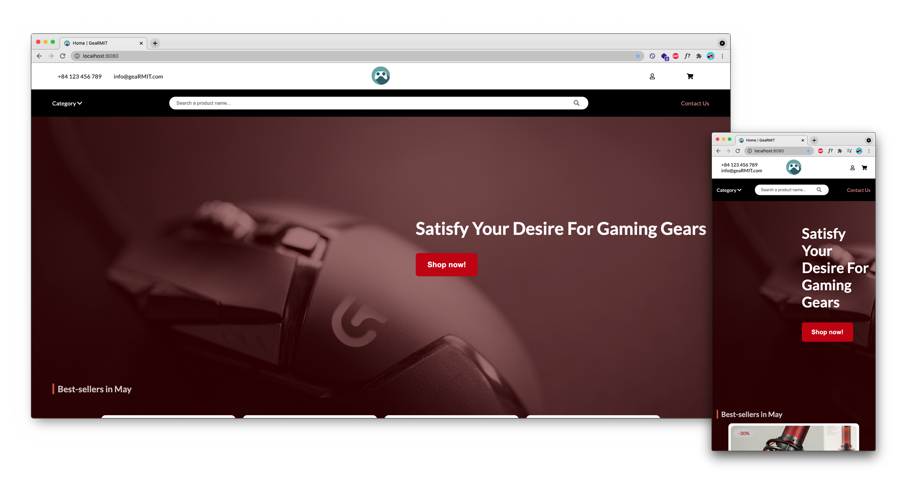
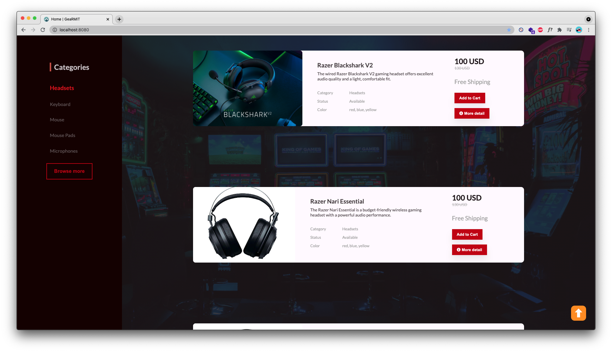
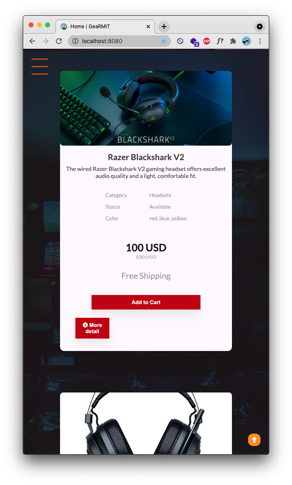
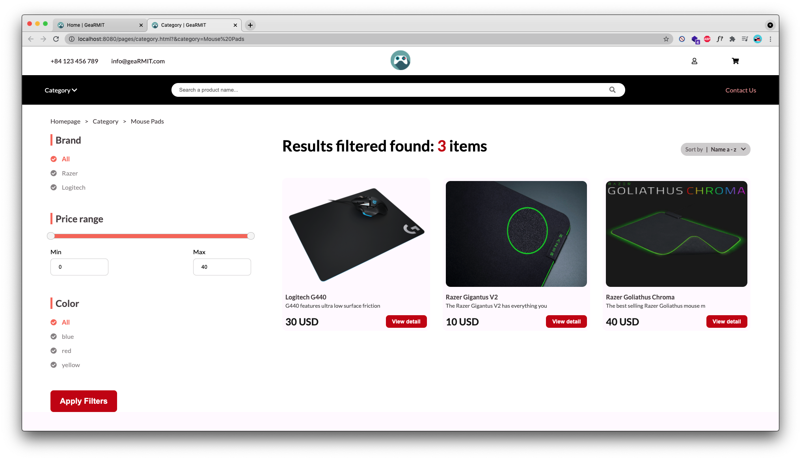
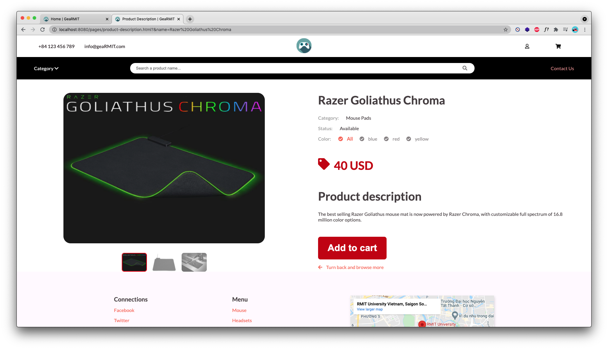
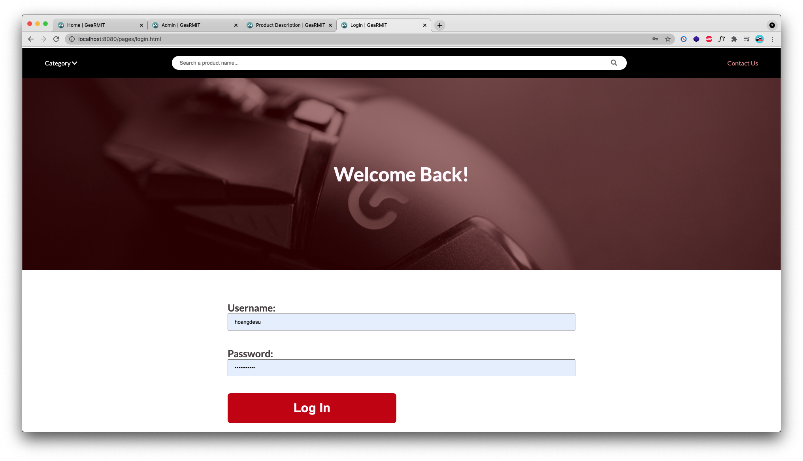
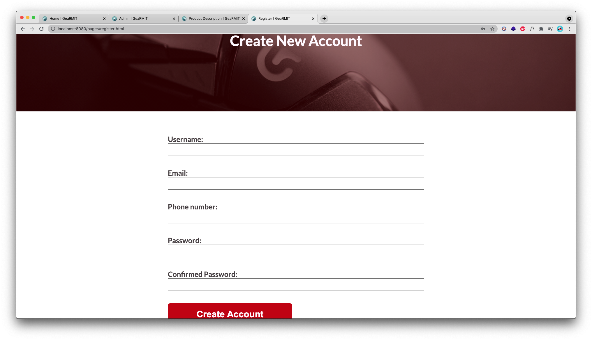
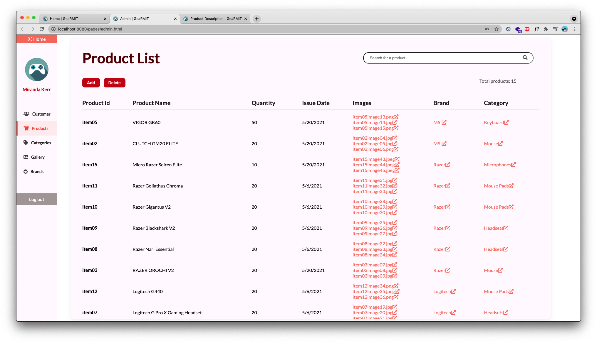

# GeaRMIT     

**Website link:** [Gearmit-env.eba-mrcbnsqb.ap-southeast-1.elasticbeanstalk.com](http://gearmit-env.eba-mrcbnsqb.ap-southeast-1.elasticbeanstalk.com/)

## Table of Contents
* [Project Description](#description)
* [How to run the project](#run)
* [Acknowledged problems](#problems)
* [Screenshots](#screenshots)
* [Contributors](#contributors)

# Project Description

**GeaRMIT** is a fullstack, mobile-friendly ecommerce website that focuses on gaming peripherals with the best prices for RMIT University community. It aims to provide a satisfying online shopping experience combined with an intuitive design which is our slogan: *"Satisfy your desire for gaming gears"*.

The application is built using the following tech stack:
* <u>Frontend:</u>
  * HTML + CSS + Vanilla JavaScript 
  * jQuery 
  * Owl Carousel
  * Font Awesome 
* <u>Backend:</u>
  * Spring framework: Spring Boot, Spring MVC, Spring Security
  * PostgreSQL
  * AWS

## How to run the project
Before building the project, make sure you have JDK 16 SE installed to run the project. Otherwise, you can re-configure your Java version in the <code>pom.xml</code> file.

Make sure you are connected to the Internet to use the mail server for account confirmation.

**Quick run:**
Make sure you have Apache Maven 3.8 installed to quickly build and run the project
1. Navigate to the <code>GeaRMIT</code> project folder
2. Open the folder in Terminal/Command line. Make sure the currently opened folder contains the <code>pom.xml</code> file
3. Type in the following command for Maven to build the project automatically: <code>mvn spring-boot:run</code>
4. Go to <code>localhost:8080</code> on your web browser
5. Give us full HD

**To use localhost database:**
  + Create a local postgres database name "gearmit" with the user name "postgres" and password "root" on port 5432
  + Create a schema in "gearmit" name "public"

**To use AWS database:**
  + Open application.properties file in "src/main/resources/"
  + Comment out line 5 - 7 (Below comment "#Localhost")
  + Uncomment line 10 - 12 (Below comment "#AWS")
  + To switch back to localhost from AWS, do the opposite

**To run the project:**
- Open the folder GeaRMIT with Intellij
- Run "create.sql" to drop all table and create table for the schema of database
- Run "populate.sql" to drop all records and add default data to the table of the database
- Run "GeaRmitApplication.java" in "src/main/java/com/group5/gearmit/" with Intellij to run the project
- Open browser and type the link "http://localhost:8080" to visit the website

**To access the admin page:** 
  - Go to the login page and login with the username: "admin" and password: "admin". 
  - Before exiting the page, make sure to logout or the admin username will be saved to the browser

## Acknowledged problems
- Dependency problem: In Intellij in Maven tab, click "Download Sources" -> Click "Reload All Maven Projects"
- Mail Server problems: 
  - Some network block connection to gmail smpt server (Ex: RMIT University network) so connect to a differenct network.
  - If the problem persist: disable firewall and anti virus software.
  - If the problem continue to persist: Comment out line 87 in "CustomerServiceI.java" in "src/main/java/com/group5/gearmit/service".
- AWS database connection problems:
  - Some network block connection to AWS (Ex: RMIT University network) so connect to a different network.
  - If the problem persist, switch back to localhost and contact the group via email.

## App screenshots

Responsive design

Category page

Product page

Login page

Create account

Admin dashboard

## Contributors
- [Quan](https://github.com/minhquan1701)
- [Long](https://github.com/dtnLong)
- [Duy](https://github.com/DuyLe2000)
- [Hoang](https://github.com/hoangdesu)
- [Minh](https://github.com/quocminh238)

